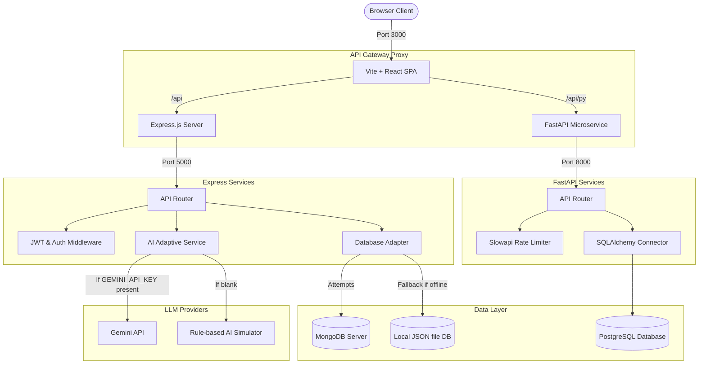
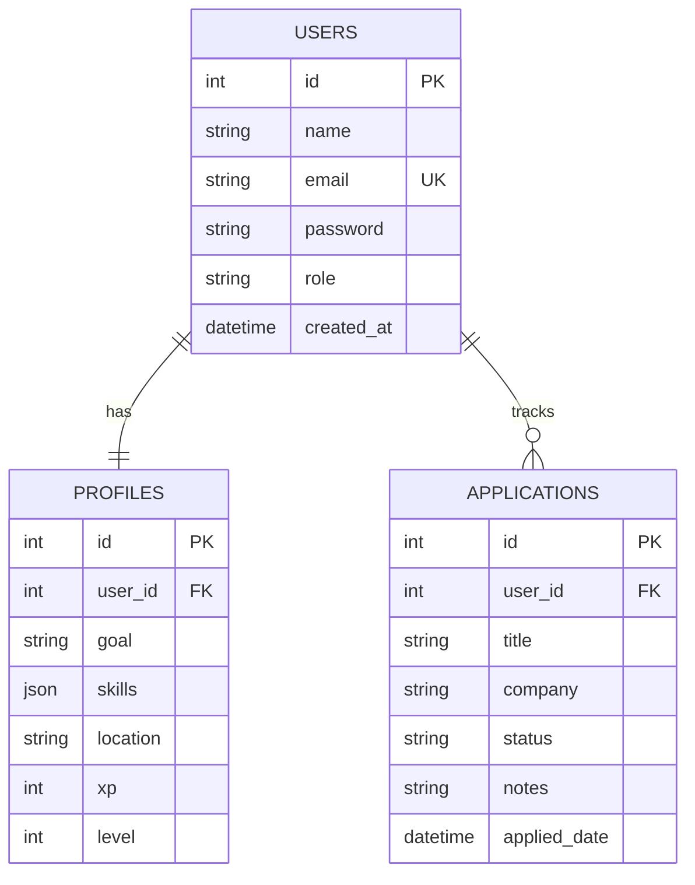

# Career GPS AI — Architecture Document

This document describes the design principles, directory structures, and dual-mode database failover systems.

## System Topology

## Relational Database (PostgreSQL) Entity Relationships

## Directory Structure

- `client/`: React client using Tailwind CSS. Consumes backend endpoints. If backend is offline, runs in a client-side sandbox storing state in `localStorage`.
- `server/`: Express API server providing registration, career profile stores, interview coach grading, resume parses, and CRM application lists.
- `fastapi-server/`: Python microservice using SQLAlchemy connection pooling to store auth states in PostgreSQL.
- `database/`: Contains default seeding data and the local file-based database fallback `local_db.json`.
- `docs/`: Technical manuals, Postman collections, and architecture assets.
- `mobile/`: Future Native app wrappers.
- `deployment/`: Production deployments and docker environment scripts.

## Database Fallback Implementation (Express)

To ease development onboarding, `server/config/db.js` wraps database operations.
1. When starting, the server attempts to connect to MongoDB.
2. If connection times out or fails (2000ms), it activates **JSON Database Mode**.
3. In JSON mode, files are parsed and saved to `database/local_db.json`. It supports basic operations: `.find()`, `.findOne()`, `.create()`, `.findByIdAndUpdate()`, and `.deleteOne()`, mirroring Mongoose.
